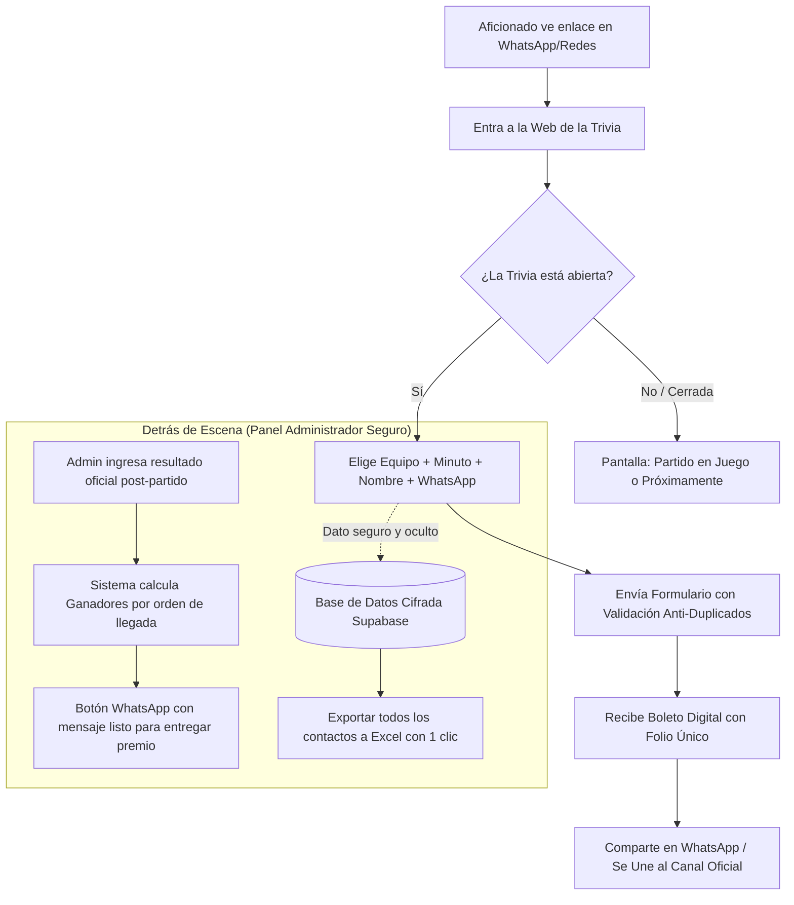
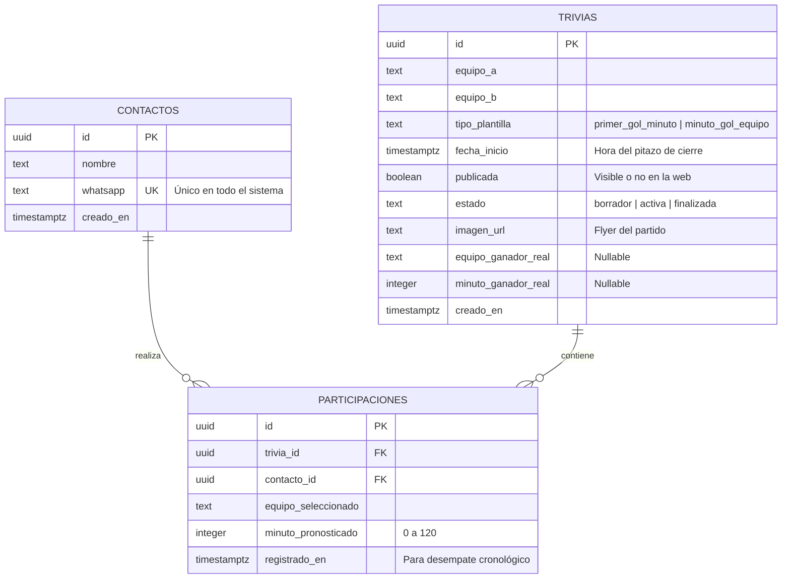
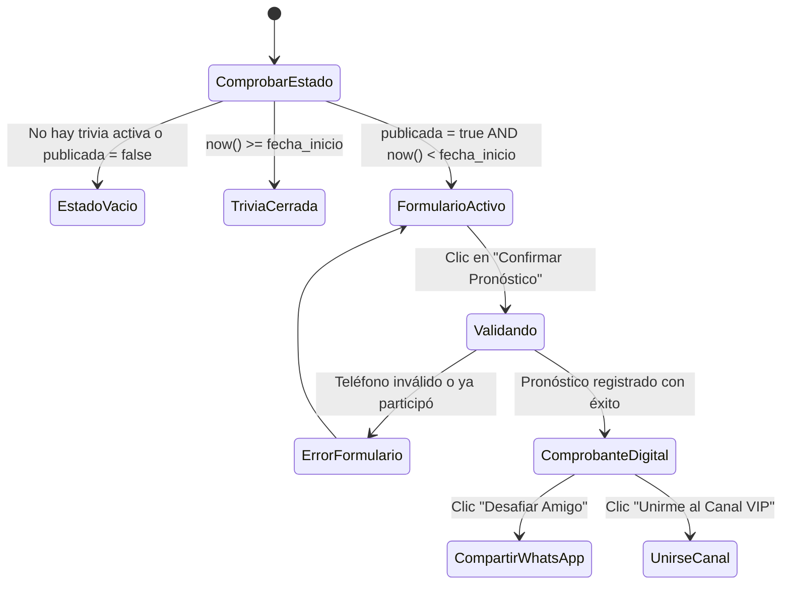
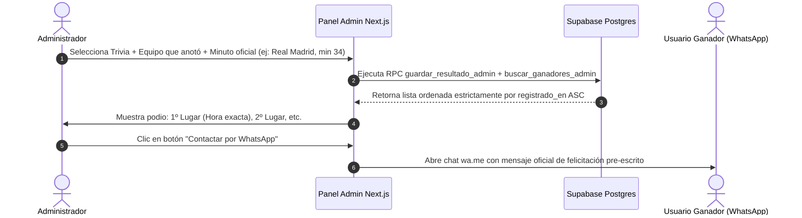

# Documento de Requisitos del Producto (PRD)
## Sistema Web de Trivias Deportivas & CRM Anti-Infiltrados (Bolicash)

* **Versión:** 2.0 (Especificación Completa para Producción)  
* **Estado:** Aprobado para Desarrollo  
* **Stack Tecnológico:** Next.js 15 (App Router, React 19) + Supabase (PostgreSQL, Auth, Storage) + Tailwind CSS + Vercel  
* **Público Objetivo:** Desarrollador Full-Stack (para ejecución técnica sin ambigüedades) y Propietario del Negocio / Operador de Marketing (para comprensión total sin tecnicismos).

---

## 0. Resumen Ejecutivo (Para Personas No Técnicas)

### ¿Qué es este sistema?
Es una aplicación web móvil interactiva donde los aficionados al fútbol pronostican qué equipo marcará el primer gol y en qué minuto exacto de un partido importante. A cambio de participar gratis, el usuario entrega su nombre y número de WhatsApp verificado.

### ¿Cuál es el problema de negocio que resuelve?
1. **Captación Masiva de Clientes (Leads):** Generar cientos o miles de contactos calificados en cada partido de fútbol.
2. **Protección Anti-Infiltrados (Blindaje de Datos):** En un grupo abierto de WhatsApp, la competencia puede ingresar, ver los números de todos los integrantes y robárselos ("infiltrados"). Con este sistema web, **ningún usuario o competidor puede ver la base de datos**. Los datos viajan directo y cifrados a un panel administrativo al que solo tiene acceso el dueño del negocio.
3. **Viralidad Inmediata:** Una vez que el usuario pronostica, el sistema le entrega un "Boleto Digital" con su folio y le da un botón directo para invitar a sus amigos por WhatsApp y unirse al canal oficial de la marca.
4. **Cero Discusiones sobre Ganadores:** El sistema registra la hora, minuto y segundo exacto en que cada persona envió su pronóstico. Si dos personas aciertan el mismo minuto, gana automáticamente quien lo envió primero.



---

## 1. Glosario Rápido (Diccionario para No Técnicos)

* **Lead:** Un contacto comercial (en este caso, un número de WhatsApp y nombre de una persona real interesada en fútbol o apuestas).
* **Next.js:** La tecnología con la que se construye la página web para que abra al instante (< 1.5 segundos) en cualquier celular.
* **Supabase:** La base de datos segura en la nube donde se guardan las trivias y los números telefónicos.
* **RLS (Row Level Security):** "Candado de base de datos". Es la regla que impide que hackers o competidores puedan leer la lista de contactos desde internet.
* **RPC (Remote Procedure Call):** Una instrucción blindada dentro del servidor que procesa los pronósticos y asegura que nadie juegue dos veces.
* **E.164:** El formato estándar internacional para escribir teléfonos (ejemplo: `+59170012345` o `+5215512345678`), evitando errores de prefijo.
* **Flyer:** La imagen promocional o afiche del partido que decora la trivia.

---

## 2. Arquitectura de Base de Datos (Especificación Técnica Supabase)

El sistema utiliza **tres tablas principales** y **un bucket de almacenamiento (Storage)**. Cada tabla cuenta con tipos estrictos, restricciones de integridad y llaves foráneas en cascada.



### 2.1. Tabla `contactos` (Directorio Central de Clientes)
* **Propósito Humano:** Almacena a cada persona que haya participado alguna vez. Si Juan participa en 5 trivias diferentes a lo largo del mes, su número de WhatsApp solo se guarda **una vez**, manteniendo la base de datos limpia y sin duplicados.
* **Estructura Técnica:**

| Campo | Tipo SQL | Modificadores | Descripción para el Desarrollador |
| :--- | :--- | :--- | :--- |
| `id` | `UUID` | `PRIMARY KEY, DEFAULT gen_random_uuid()` | Identificador único interno del contacto. |
| `nombre` | `TEXT` | `NOT NULL` | Nombre proporcionado por el usuario (mínimo 2, máx 80 caracteres). |
| `whatsapp` | `TEXT` | `NOT NULL, UNIQUE` | Número en formato internacional E.164 (ej: `+59170012345`). Índice único obligatorio. |
| `creado_en` | `TIMESTAMPTZ` | `NOT NULL, DEFAULT now()` | Fecha y hora del primer registro del usuario en la plataforma. |

### 2.2. Tabla `trivias` (Eventos y Partidos Deportivos)
* **Propósito Humano:** Cada partido es una trivia. Aquí se configuran los equipos, a qué hora se cierra automáticamente la inscripción, qué foto lleva y, una vez terminado el partido, cuál fue el resultado real.
* **Estructura Técnica:**

| Campo | Tipo SQL | Modificadores | Descripción para el Desarrollador |
| :--- | :--- | :--- | :--- |
| `id` | `UUID` | `PRIMARY KEY, DEFAULT gen_random_uuid()` | Identificador único de la dinámica. |
| `equipo_a` | `TEXT` | `NOT NULL` | Nombre del equipo local o primera opción (ej: "Real Madrid"). |
| `equipo_b` | `TEXT` | `NOT NULL` | Nombre del equipo visitante o segunda opción (ej: "Barcelona"). |
| `tipo_plantilla` | `TEXT` | `NOT NULL, DEFAULT 'minuto_gol_equipo'` | `CHECK (tipo_plantilla IN ('primer_gol_minuto', 'minuto_gol_equipo'))`. |
| `fecha_inicio` | `TIMESTAMPTZ` | `NOT NULL` | Momento exacto del pitazo inicial. A partir de este milisegundo el servidor rechaza registros. |
| `publicada` | `BOOLEAN` | `NOT NULL, DEFAULT false` | Controla si la trivia es visible públicamente en el Home de la web. |
| `estado` | `TEXT` | `NOT NULL, DEFAULT 'borrador'` | `CHECK (estado IN ('borrador', 'activa', 'finalizada'))`. |
| `imagen_url` | `TEXT` | `NULLABLE` | URL pública de la imagen del afiche/flyer alojada en Supabase Storage. |
| `equipo_ganador_real`| `TEXT` | `NULLABLE` | Nombre del equipo que marcó el gol oficial según el árbitro/admin. |
| `minuto_ganador_real`| `INTEGER` | `NULLABLE` | Minuto oficial del gol (0 a 120). |
| `creado_en` | `TIMESTAMPTZ` | `NOT NULL, DEFAULT now()` | Fecha de creación del evento en el panel admin. |

### 2.3. Tabla `participaciones` (Pronósticos de Usuarios)
* **Propósito Humano:** Registra cada voto emitido. Contiene el equipo elegido, el minuto y la hora exacta con milisegundos para desempatar si varias personas aciertan.
* **Estructura Técnica:**

| Campo | Tipo SQL | Modificadores | Descripción para el Desarrollador |
| :--- | :--- | :--- | :--- |
| `id` | `UUID` | `PRIMARY KEY, DEFAULT gen_random_uuid()` | Identificador del boleto (se usa como Folio). |
| `trivia_id` | `UUID` | `NOT NULL, REFERENCES trivias(id) ON DELETE CASCADE` | Llave foránea hacia la trivia en juego. |
| `contacto_id` | `UUID` | `NOT NULL, REFERENCES contactos(id) ON DELETE CASCADE` | Llave foránea hacia el contacto que jugó. |
| `equipo_seleccionado` | `TEXT` | `NOT NULL` | Debe coincidir con `equipo_a` o `equipo_b`. |
| `minuto_pronosticado` | `INTEGER` | `NOT NULL, CHECK (minuto_pronosticado BETWEEN 0 AND 120)` | Minuto elegido por el aficionado. |
| `registrado_en` | `TIMESTAMPTZ` | `NOT NULL, DEFAULT now()` | Marca de tiempo precisa utilizada para resolver empates (`ASC`). |
| **Constraint Único** | `UNIQUE(trivia_id, contacto_id)` | **CRÍTICO** | Impide a nivel de motor de base de datos que el mismo número participe 2 veces en el mismo partido. |

### 2.4. Supabase Storage Bucket: `flyers`
* **Nombre del Bucket:** `flyers`
* **Acceso:** Público para lectura (`SELECT`), restringido a usuarios autenticados (Admin) para subida (`INSERT`) y eliminación (`DELETE`).
* **Límite de Tamaño:** 5 MB por archivo.
* **Formatos Permitidos:** `image/png`, `image/jpeg`, `image/webp`.

---

## 3. Protocolo de Seguridad "Anti-Infiltrados" & Reglas RLS

> [!IMPORTANT]
> **Definición de Seguridad Anti-Infiltrados:**
> El mayor riesgo de este negocio es que un competidor use herramientas de desarrollador (F12) o consulte la API pública para extraer la lista de teléfonos de los clientes. Con esta arquitectura, **el acceso anónimo de lectura a contactos y participaciones está completamente deshabilitado (RLS = denegado)**.

### 3.1. Reglas RLS (Row Level Security)
1. **Tabla `trivias`:**
   * `SELECT`: Permitido para rol `anon` y `authenticated` **únicamente** cuando `publicada = true`.
   * `INSERT, UPDATE, DELETE`: Permitido **únicamente** para rol `authenticated` (Admin logueado).
2. **Tabla `contactos`:**
   * `SELECT, INSERT, UPDATE, DELETE`: Totalmente bloqueado para rol `anon`.
   * Solo accesible por el rol `authenticated` mediante la función RPC del panel admin.
3. **Tabla `participaciones`:**
   * `SELECT, INSERT, UPDATE, DELETE`: Totalmente bloqueado para rol `anon`.

### 3.2. Procedimientos Almacenados Cifrados (RPCs con `SECURITY DEFINER`)
Todo el registro de usuarios se realiza a través de una función segura en Postgres:

* **Función `registrar_participacion(...)`**:
  1. Verifica que la trivia exista y tenga `publicada = true`. Si no, retorna excepción `TRIVIA_NO_PUBLICADA`.
  2. Comprueba en el reloj del servidor si `now() >= fecha_inicio`. Si ya empezó, retorna excepción `FORMULARIO_CERRADO` (imposible engañar con la hora del teléfono).
  3. Inserta o actualiza el nombre del contacto en la tabla `contactos` (`ON CONFLICT (whatsapp) DO UPDATE SET nombre = excluded.nombre`).
  4. Inserta la participación. Si salta la restricción de unicidad, captura la excepción y retorna `YA_PARTICIPASTE`.
  5. Retorna únicamente el objeto `Boleto` con los datos de esa participación específica. **Nunca retorna datos de otros usuarios.**

### 3.3. Protección contra Bots y Spam (Honeypot + Rate Limit)
* **Campo Señuelo (Honeypot):** El formulario frontend incluye un campo invisible oculto por CSS (`tabIndex={-1}`, `display: none`). Si un bot automatizado llena este campo, el servidor descarta la solicitud inmediatamente sin procesarla.
* **Validación E.164 Estricta:** Se valida con regex `/^\+\d{7,15}$/` y biblioteca `libphonenumber-js` para evitar números inventados o incompletos.

---

## 4. Módulo Frontend Público (La Web del Usuario)

### 4.1. Principios de Diseño
* **Mobile-First Radical:** 95% del tráfico proviene de enlaces abiertos dentro de la aplicación móvil de WhatsApp o Instagram. La interfaz debe pesar menos de 100 KB en su primer render y no tener elementos pesados que causen lentitud.
* **Paleta y Tipografía:** Colores modernos (fondo oscuro o minimalista con contrastes altos), botones táctiles grandes (mínimo 48px de alto para fácil pulsación con el pulgar) y fuentes legibles (Geist / Inter).

### 4.2. Flujo de Pantallas del Usuario



### 4.3. Especificación de Componentes de la Pantalla Pública

#### A. Cabecera (Header)
* Logotipo de **Bolicash**.
* Subtítulo con indicador visual en vivo: punto verde pulsante `● Trivias Deportivas · Pronostica y Gana`.

#### B. Tarjeta del Partido (Match Card)
* Si la trivia tiene `imagen_url`: muestra el banner publicitario del encuentro en la parte superior con bordes redondeados.
* Nombres de los equipos en tipografía destacada: `[Equipo A]` **VS** `[Equipo B]`.
* **Temporizador de Cuenta Regresiva Dinámico:**
  * Muestra formato `DDd HHh MMm` o `HH:MM:SS` sincronizado con la fecha de inicio del evento.
  * Si llega a cero mientras el usuario tiene la página abierta, bloquea de inmediato los campos y muestra el aviso "¡Formulario Cerrado!".

#### C. Banner de Requisito de Recarga & CTA Directo a WhatsApp (Conversión de Ventas)
* **Tarjeta de Requisito:** Bloque visual destacado con borde neón/azul e ícono de billetera:
  `REQUISITO: Haber realizado una recarga con BOLI~CASH el día de hoy antes del inicio del partido.`
* **Botón de Venta Directa:** Enlace visible:  
  `👉 ¿Aún no recargaste hoy? Toca aquí para recargar por WhatsApp antes de jugar`  
  (Redirige a `wa.me/[WHATSAPP_CAJERO]?text=Hola%20BoliCash,%20quiero%20hacer%20una%20recarga%20para%20participar%20en%20la%20trivia`).

#### D. Selector de Pronóstico
1. **Selección de Equipo:** Dos tarjetas/botones seleccionables con el nombre y escudo de cada equipo. El usuario debe tocar uno obligatoriamente.
2. **Selección de Minuto (0 a 120):**
   * Control interactivo con botones de incremento/decremento rápido (`-` y `+`).
   * **Chips de acceso rápido:** Botones rápidos para minutos populares (`15'`, `30'`, `45'`, `60'`, `75'`, `90'`).
   * Visualizador central de gran tamaño: ej. `Minuto 45'`.

#### D. Formulario de Contacto
1. **Campo Nombre:** Input de texto regular con placeholder: *"Ej. Carlos Meneses"*.
2. **Campo WhatsApp:** Componente internacional con selector desplegable de banderas de país, formateo automático y detección de errores de longitud.
3. **Botón Principal de Acción:**
   * Texto: *"CONFIRMAR MI PRONÓSTICO"*.
   * Estado de carga (*Loading Spinner*): Se deshabilita al primer clic para evitar envíos dobles por desesperación del usuario.

#### E. Pantalla de Éxito / Boleto Digital (Comprobante)
Una vez enviado con éxito, el formulario se sustituye instantáneamente por un recibo digital:
* **Indicador visual:** Check verde `● Pronóstico Confirmado`.
* **Folio Único:** Código alfanumérico generado a partir del UUID (ej: `FOLIO #A4F91C`).
* **Detalle del Recibo:**
  * Encuentro: *Equipo A vs Equipo B*
  * Selección: *Gol de [Equipo] en el minuto [X]’*
  * Teléfono: *Número registrado (ofuscado parcialmente por privacidad, ej: +591 •••• 2345)*
  * Fecha y hora exacta con segundos de registro.
* **Botones de Conversión y Viralidad:**
  1. **Botón "Copiar Folio":** Copia el identificador al portapapeles con mensaje de confirmación de 2 segundos.
  2. **Botón "Desafiar a un Amigo en WhatsApp":** Abre un chat de WhatsApp con el mensaje:  
     `"¡Acabo de registrar mi pronóstico en Bolicash para [Equipo A] vs [Equipo B]! Dije que anota [Equipo] al minuto [X]'. Mi folio es [FOLIO]. ¿Tú a quién le vas? Juega gratis aquí: [URL_DEL_SITIO]"`
  3. **Botón "Unirme al Canal Oficial":** Enlace directo al canal o grupo de difusión de la marca para mantener al usuario fidelizado.

#### F. Pantalla de Estado Vacío (Empty State)
Si en el sistema no hay ninguna trivia con `publicada = true`:
* Ilustración o ícono de estadio/balón deportivo.
* Título: *"Próximamente Nueva Dinámica"*.
* Descripción: *"Actualmente no hay trivias activas. Mantente atento a nuestras redes y grupos de WhatsApp para el próximo partido."*

---

## 5. Módulo Backend & Panel de Control de Administrador (Backoffice)

Ruta protegida: `/admin` (requiere login vía Supabase Auth en `/login`). Si una persona no autenticada intenta entrar, el middleware de Next.js la redirige al login.

```
/admin
  ├── / (Dashboard General: KPIs de contactos, trivias y participaciones)
  ├── /trivias (Listado, creación, edición, toggle de publicación)
  ├── /participaciones (Auditoría en vivo de votos registrados)
  ├── /ganadores (Filtro oficial de resultados y contacto por WhatsApp)
  └── /contactos (CRM central con exportación a Excel/CSV)
```

### 5.1. Dashboard Principal (`/admin`)
Tarjetas de resumen rápido con números en tiempo real:
* **Total de Trivias:** Conteo global de dinámicas creadas.
* **Base de Datos de Contactos:** Número total de contactos únicos captados.
* **Participaciones Acumuladas:** Total de pronósticos emitidos históricamente.

### 5.2. Módulo de Gestión de Trivias (`/admin/trivias`)
* **Botón "Nueva Trivia":** Abre un formulario modal que solicita:
  * Equipo Local (`equipo_a`) y Equipo Visitante (`equipo_b`).
  * Tipo de plantilla (por defecto: `minuto_gol_equipo`).
  * Fecha y hora de cierre (Selector de fecha y hora local sincronizado con UTC en base de datos).
  * Carga de Afiche/Flyer (Input de archivo con subida directa a Supabase Storage `flyers`).
  * Estado inicial (`borrador` o `activa`).
* **Tabla de Trivias Existentes:**
  * Columnas: Partido, Plantilla, Cierre (hora local), Estado (Badge de color), En Web (Toggle Switch), Total Participaciones, Acciones.
  * **Interruptor de Publicación Rápida (Toggle Switch):** Permite cambiar con un solo clic `publicada = true/false` sin recargar la página.
  * **Botón Eliminar:** Con confirmación previa para evitar borrados accidentales.

### 5.3. Módulo de Filtrado de Ganadores (`/admin/ganadores`)
El corazón del sistema para la entrega de premios post-partido:



1. **Selector de Entrada:**
   * Lista desplegable para seleccionar el partido finalizado.
   * Selector del equipo que anotó el primer gol.
   * Campo numérico del minuto oficial del gol.
   * Botón: **"Guardar Resultado y Buscar Ganadores"**.
2. **Tabla de Resultados de Ganadores:**
   * Muestra únicamente a los participantes que acertaron **ambos campos con exactitud**.
   * Ordenados cronológicamente por `registrado_en ASC` (desempate irrefutable).
   * Columnas: Posición (1º, 2º, 3º...), Nombre, Número de WhatsApp, Minuto, Marca de Tiempo exacta (`DD/MM/AAAA HH:mm:ss.SSS`), Estado del Premio.
3. **Flujo de Verificación y Acciones por Ganador:**
   * **Botón 1: "Verificar y Contactar por WhatsApp":** Abre el chat de WhatsApp con el ganador (`https://wa.me/[NUMERO]?text=...`). El cajero verifica en el historial de ese mismo chat si el usuario le envió comprobante de recarga hoy antes del partido. Si sí recargó, le transfiere el premio de inmediato.
   * **Botón 2: "Descalificar (Sin Recarga)":** Si el usuario no registra recargas en su chat de WhatsApp de ese día, el administrador presiona este botón. El sistema marca el registro como descalificado y asciende automáticamente al **siguiente participante de la lista (2º puesto)** al podio de ganador.

### 5.4. Módulo de CRM de Contactos (`/admin/contactos`)
* **Listado General:** Muestra todos los clientes acumulados con paginación/scroll rápido.
* **Columnas:** Número secuencial, Nombre, Teléfono formateado, Fecha de captura.
* **Buscador:** Barra de filtrado instantáneo por nombre o número de teléfono.
* **Botón "Exportar a CSV / Excel":**
  * Descarga directa con cabecera `Content-Type: text/csv; charset=utf-8` e inserción de BOM UTF-8 (`\uFEFF`) para que el archivo abra con caracteres correctos (tildes, eñes) en cualquier versión de Microsoft Excel en Windows y Mac.

### 5.5. Auditoría de Participaciones (`/admin/participaciones`)
* Visualizador detallado de cada voto emitido para un partido específico. Permite al administrador comprobar cualquier reclamo de un participante consultando su folio o teléfono.

---

## 6. Matriz de Casos Borde y Reglas de Negocio

| Situación / Caso Borde | Comportamiento Esperado del Sistema | Responsable Técnico |
| :--- | :--- | :--- |
| **El usuario tiene el reloj de su celular adelantado o atrasado.** | El sistema ignora la hora del celular del usuario. El cierre se valida únicamente con `now()` del servidor Postgres. | Servidor / Supabase RPC |
| **Dos o más personas aciertan exactamente el mismo minuto y equipo.** | El ganador es quien registró primero en el tiempo. La consulta SQL aplica `ORDER BY p.registrado_en ASC`. | Base de Datos SQL |
| **Un usuario intenta registrarse dos veces con el mismo número.** | El sistema bloquea el registro con el mensaje *"Ya participaste en esta trivia. Límite: 1 pronóstico por número"*. | Constraint `UNIQUE(trivia_id, contacto_id)` |
| **El usuario cambia de nombre en su segunda trivia.** | Su número de teléfono se conserva intacto, pero se actualiza su nombre al más reciente en la tabla `contactos`. | Cláusula `ON CONFLICT (whatsapp) DO UPDATE` |
| **El partido queda 0-0 o se suspende.** | El administrador puede dejar los campos de ganador vacíos o asignar el valor correspondiente definido en las bases legales. | Lógica de Negocio Admin |
| **Un usuario envía el formulario en el segundo exacto del pitazo.** | Si `now() >= fecha_inicio`, el servidor rechaza el paquete con código de error amigable: *"El formulario ya cerró"*. | Server Action `participar.ts` |
| **La imagen del flyer es muy pesada (> 5 MB).** | El bucket de Supabase Storage rechaza la subida automáticamente y muestra un aviso en el formulario admin. | Configuración de Storage Bucket |

---

## 7. Pila Tecnológica & Despliegue (Tech Stack)

* **Framework Web:** Next.js 15 (React 19, Server Components, Server Actions).
* **Estilos & UI:** Tailwind CSS con tokens de diseño personalizados (tema deportivo sobrio, variables CSS).
* **Base de Datos & Cifrado:** Supabase Cloud (PostgreSQL 15+ con extensiones UUID y RLS).
* **Almacenamiento de Archivos:** Supabase Storage (Bucket `flyers`).
* **Autenticación:** Supabase Auth (Email / Password para el panel de administración).
* **Hosting & CDN:** Vercel (Edge Network global para carga ultrarrápida en conexiones móviles).
* **Control de Versiones:** Git / GitHub.

### Variables de Entorno Requeridas (`.env.local`)
```env
# Conexión Pública (Cliente Next.js)
NEXT_PUBLIC_SUPABASE_URL=https://tu-proyecto.supabase.co
NEXT_PUBLIC_SUPABASE_ANON_KEY=tu-clave-anonima-publica

# Conexión Administrativa (Solo lectura/escritura en servidor)
SUPABASE_SERVICE_ROLE_KEY=tu-clave-secreta-service-role
```

---

## 8. Guía de Aceptación y Checklist para el Desarrollador

Antes de dar el proyecto por finalizado y entregado, el desarrollador debe verificar cada uno de los siguientes puntos:

- [ ] **Seguridad Anti-Infiltrados:** Intentar consultar la tabla `contactos` o `participaciones` con la clave anónima desde la consola del navegador y comprobar que Supabase devuelve error `403 Forbidden` o array vacío.
- [ ] **Prevención de Duplicados:** Intentar enviar dos pronósticos con el mismo número de teléfono para el mismo partido y verificar que el segundo intento es rechazado con mensaje claro.
- [ ] **Cierre Exacto de Tiempo:** Crear una trivia con fecha de cierre en 1 minuto. Esperar que el reloj llegue a cero y confirmar que el formulario se deshabilita automáticamente y el servidor rechaza envíos.
- [ ] **Desempate de Ganadores:** Registrar dos participantes con el mismo pronóstico (uno a las 10:00:00 y otro a las 10:00:05). Asignar ese resultado como ganador y verificar que el sistema posiciona al primero en la parte superior del podio.
- [ ] **Generación de Comprobante:** Verificar que el boleto digital se genera al instante con su folio y que los botones de compartir en WhatsApp abren la app con el mensaje formateado.
- [ ] **Exportación Limpia a Excel:** Probar la descarga de contactos desde el panel admin y abrir el archivo `.csv` en Excel comprobando que los acentos y caracteres especiales no se dañen.
- [ ] **Carga de Afiche/Flyer:** Subir una imagen desde el panel de creación de trivia y comprobar que se visualiza correctamente en el formulario público.

---

### ¿Cómo exportar este documento a PDF?
1. **Desde VS Code / Cursor:** Abre este archivo, presiona `Ctrl+Shift+P` (o `Cmd+Shift+P` en Mac), busca `Markdown: Open Preview`, haz clic derecho y selecciona **"Print to PDF"** o utiliza la extensión **"Markdown PDF"**.
2. **Desde el Navegador:** Puedes abrir la vista previa en cualquier visor markdown y usar la opción del navegador `Archivo > Imprimir > Guardar como PDF`.
